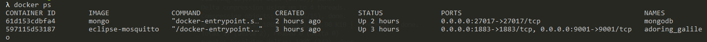
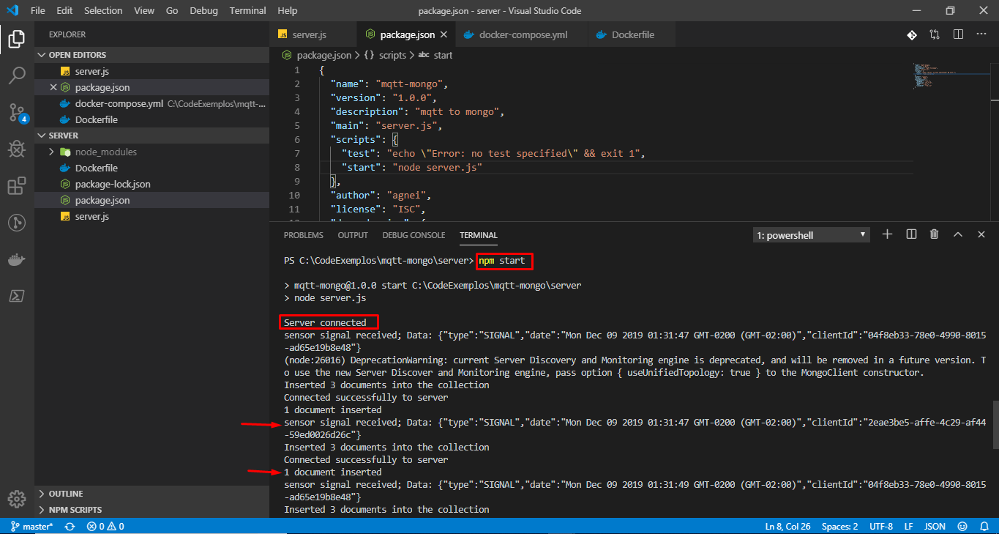
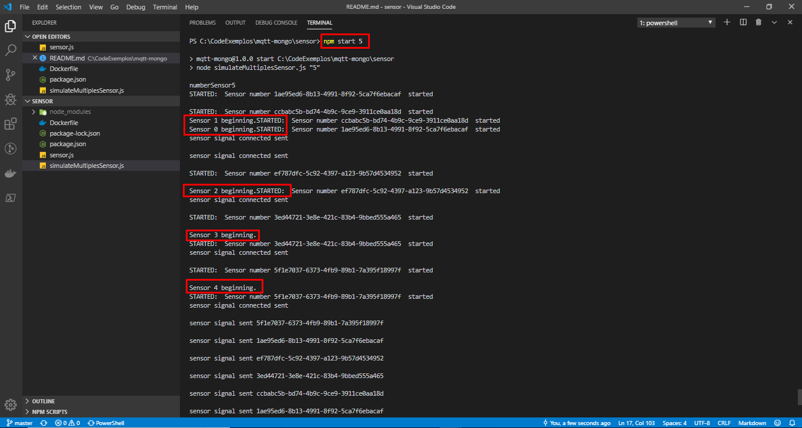
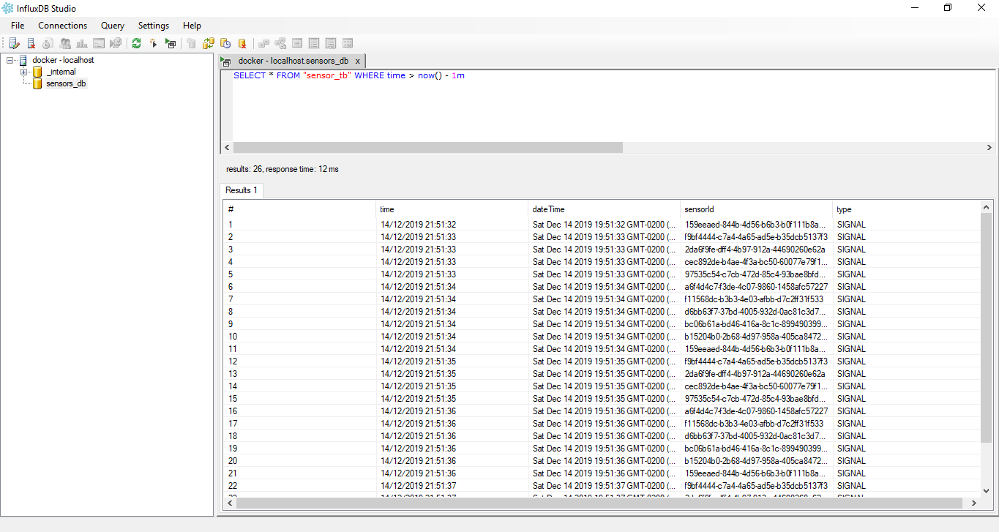

# MQTT Multiples sensor Example Application

A sample application built that shows how MQTT could be used to manage a multiples sensor sent data
to a server,  which will record it into da mongo and influxdb data base


##RUN 

for localhost porpose use command line for start mqtt container and mongodb

docker run --name mongodb -p 27017:27017 -d mongo

docker run -it -d -p 1883:1883 -p 9001:9001  eclipse-mosquitto

 docker run -d -p 8086:8086 influxdb:latest

docker ps -a

MAKE SURE both mongodb, influxdb and mosquitto service broker container are running before run server and sensor 



## Starting SERVER

access server folder and run:

```
npm install 
```

```
node server.js
or 
npm start
```




## Starting Sensor

access sensor folder and run:

```
npm install

node simulateMultiplesSensor.js 5
```



where "5" is the number of sensor you want to simulate. You can use any positive number you want.
the more,  more it will be sensors initialized in your memory.


You can use CymaticLabs.InfluxDB.Studio project to select data in influxdb
 [InfluxDB Studio](https://github.com/CymaticLabs/InfluxDBStudio)



 and 


Use Mongo Compass Comunity to select data in MongoDb 
[InfluxDB Studio](https://www.mongodb.com/products/compass)


Docker Commands:  

cd .\server 
docker build . -t server

cd .\sensor 
docker build . -t sensors

docker-compose -f docker-compose.yml --no-ansi build --no-cache
docker-compose -f docker-compose.yml up -d --no-build --force-recreate --remove-orphans
docker-compose -f docker-compose.yml down

netstat -a -b -n -o > ports_running.txt

docker exec -it 333c8bb35283 bash
docker exec -it 333c8bb35283 /bin/bash
docker exec -it 333c8bb35283 /bin/sh

docker logs --tail 50 --follow --timestamps 333c8bb35283

docker-compose -f docker-compose.yml logs -f server sensors